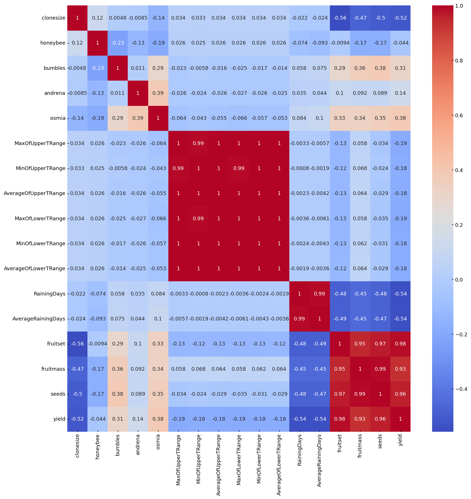
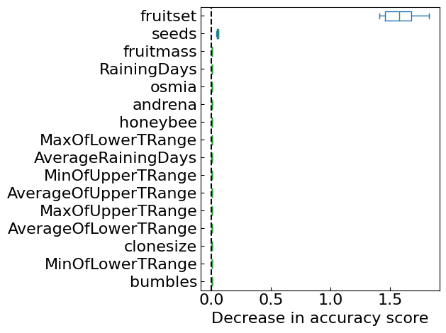

# Wild Blueberry Yield Prediction and Variable Importance Visualization using Random Forests

## About Data
Copyright (c) 2020 Saurabh Shahane  
 (Licensed under CC BY 4.0）https://creativecommons.org/licenses/by/4.0/  
  
[Wild Blueberry Yield Prediction(kaggle)](https://www.kaggle.com/datasets/saurabhshahane/wild-blueberry-yield-prediction)

## About Code
This code aims to estimate the wild blueberry yield from their measurements using Random Forest.    
Also, In this code visualizes the importance of variables.


```python
import numpy as np
import pandas as pd
import matplotlib.pyplot as plt
import seaborn as sns
from itertools import zip_longest
from sklearn.ensemble import RandomForestRegressor
from sklearn.model_selection import train_test_split
from sklearn.metrics import r2_score
from sklearn.metrics import mean_squared_error
from sklearn.metrics import mean_absolute_error
from sklearn.inspection import permutation_importance
from sklearn.inspection import partial_dependence
import shap
import warnings
```


```python
warnings.simplefilter('ignore')
```


```python
%matplotlib inline
plt.rcParams['xtick.direction'] = 'in'
plt.rcParams['ytick.direction'] = 'in'
plt.rcParams['xtick.minor.visible'] = False
plt.rcParams['ytick.minor.visible'] = False
```


```python
df = pd.read_csv('Data/WildBlueberryPollinationSimulationData.csv')
df.drop('Row#', axis=1,inplace=True)
df
```


<div>
<table border="1" class="dataframe">
  <thead>
    <tr style="text-align: right;">
      <th></th>
      <th>clonesize</th>
      <th>honeybee</th>
      <th>bumbles</th>
      <th>andrena</th>
      <th>osmia</th>
      <th>MaxOfUpperTRange</th>
      <th>MinOfUpperTRange</th>
      <th>AverageOfUpperTRange</th>
      <th>MaxOfLowerTRange</th>
      <th>MinOfLowerTRange</th>
      <th>AverageOfLowerTRange</th>
      <th>RainingDays</th>
      <th>AverageRainingDays</th>
      <th>fruitset</th>
      <th>fruitmass</th>
      <th>seeds</th>
      <th>yield</th>
    </tr>
  </thead>
  <tbody>
    <tr>
      <th>0</th>
      <td>37.5</td>
      <td>0.750</td>
      <td>0.250</td>
      <td>0.250</td>
      <td>0.250</td>
      <td>86.0</td>
      <td>52.0</td>
      <td>71.9</td>
      <td>62.0</td>
      <td>30.0</td>
      <td>50.8</td>
      <td>16.00</td>
      <td>0.26</td>
      <td>0.410652</td>
      <td>0.408159</td>
      <td>31.678898</td>
      <td>3813.165795</td>
    </tr>
    <tr>
      <th>1</th>
      <td>37.5</td>
      <td>0.750</td>
      <td>0.250</td>
      <td>0.250</td>
      <td>0.250</td>
      <td>86.0</td>
      <td>52.0</td>
      <td>71.9</td>
      <td>62.0</td>
      <td>30.0</td>
      <td>50.8</td>
      <td>1.00</td>
      <td>0.10</td>
      <td>0.444254</td>
      <td>0.425458</td>
      <td>33.449385</td>
      <td>4947.605663</td>
    </tr>
    <tr>
      <th>2</th>
      <td>37.5</td>
      <td>0.750</td>
      <td>0.250</td>
      <td>0.250</td>
      <td>0.250</td>
      <td>94.6</td>
      <td>57.2</td>
      <td>79.0</td>
      <td>68.2</td>
      <td>33.0</td>
      <td>55.9</td>
      <td>16.00</td>
      <td>0.26</td>
      <td>0.383787</td>
      <td>0.399172</td>
      <td>30.546306</td>
      <td>3866.798965</td>
    </tr>
    <tr>
      <th>3</th>
      <td>37.5</td>
      <td>0.750</td>
      <td>0.250</td>
      <td>0.250</td>
      <td>0.250</td>
      <td>94.6</td>
      <td>57.2</td>
      <td>79.0</td>
      <td>68.2</td>
      <td>33.0</td>
      <td>55.9</td>
      <td>1.00</td>
      <td>0.10</td>
      <td>0.407564</td>
      <td>0.408789</td>
      <td>31.562586</td>
      <td>4303.943030</td>
    </tr>
    <tr>
      <th>4</th>
      <td>37.5</td>
      <td>0.750</td>
      <td>0.250</td>
      <td>0.250</td>
      <td>0.250</td>
      <td>86.0</td>
      <td>52.0</td>
      <td>71.9</td>
      <td>62.0</td>
      <td>30.0</td>
      <td>50.8</td>
      <td>24.00</td>
      <td>0.39</td>
      <td>0.354413</td>
      <td>0.382703</td>
      <td>28.873714</td>
      <td>3436.493543</td>
    </tr>
    <tr>
      <th>...</th>
      <td>...</td>
      <td>...</td>
      <td>...</td>
      <td>...</td>
      <td>...</td>
      <td>...</td>
      <td>...</td>
      <td>...</td>
      <td>...</td>
      <td>...</td>
      <td>...</td>
      <td>...</td>
      <td>...</td>
      <td>...</td>
      <td>...</td>
      <td>...</td>
      <td>...</td>
    </tr>
    <tr>
      <th>772</th>
      <td>10.0</td>
      <td>0.537</td>
      <td>0.117</td>
      <td>0.409</td>
      <td>0.058</td>
      <td>86.0</td>
      <td>52.0</td>
      <td>71.9</td>
      <td>62.0</td>
      <td>30.0</td>
      <td>50.8</td>
      <td>3.77</td>
      <td>0.06</td>
      <td>0.486815</td>
      <td>0.428012</td>
      <td>33.447471</td>
      <td>5333.873335</td>
    </tr>
    <tr>
      <th>773</th>
      <td>40.0</td>
      <td>0.537</td>
      <td>0.117</td>
      <td>0.409</td>
      <td>0.058</td>
      <td>86.0</td>
      <td>52.0</td>
      <td>71.9</td>
      <td>62.0</td>
      <td>30.0</td>
      <td>50.8</td>
      <td>3.77</td>
      <td>0.06</td>
      <td>0.342841</td>
      <td>0.377915</td>
      <td>28.462005</td>
      <td>3373.436842</td>
    </tr>
    <tr>
      <th>774</th>
      <td>20.0</td>
      <td>0.537</td>
      <td>0.117</td>
      <td>0.409</td>
      <td>0.058</td>
      <td>86.0</td>
      <td>52.0</td>
      <td>71.9</td>
      <td>62.0</td>
      <td>30.0</td>
      <td>50.8</td>
      <td>24.00</td>
      <td>0.39</td>
      <td>0.404617</td>
      <td>0.401670</td>
      <td>30.748240</td>
      <td>4203.027624</td>
    </tr>
    <tr>
      <th>775</th>
      <td>20.0</td>
      <td>0.537</td>
      <td>0.117</td>
      <td>0.409</td>
      <td>0.058</td>
      <td>89.0</td>
      <td>39.0</td>
      <td>65.6</td>
      <td>66.0</td>
      <td>28.0</td>
      <td>45.3</td>
      <td>3.77</td>
      <td>0.06</td>
      <td>0.401538</td>
      <td>0.399935</td>
      <td>30.582161</td>
      <td>4166.299735</td>
    </tr>
    <tr>
      <th>776</th>
      <td>20.0</td>
      <td>0.537</td>
      <td>0.117</td>
      <td>0.409</td>
      <td>0.058</td>
      <td>89.0</td>
      <td>39.0</td>
      <td>65.6</td>
      <td>66.0</td>
      <td>28.0</td>
      <td>45.3</td>
      <td>24.00</td>
      <td>0.39</td>
      <td>0.384646</td>
      <td>0.392303</td>
      <td>29.742583</td>
      <td>3943.131681</td>
    </tr>
  </tbody>
</table>
<p>777 rows × 17 columns</p>
</div>


```python
df.info()
```

    <class 'pandas.core.frame.DataFrame'>
    RangeIndex: 777 entries, 0 to 776
    Data columns (total 17 columns):
     #   Column                Non-Null Count  Dtype  
    ---  ------                --------------  -----  
     0   clonesize             777 non-null    float64
     1   honeybee              777 non-null    float64
     2   bumbles               777 non-null    float64
     3   andrena               777 non-null    float64
     4   osmia                 777 non-null    float64
     5   MaxOfUpperTRange      777 non-null    float64
     6   MinOfUpperTRange      777 non-null    float64
     7   AverageOfUpperTRange  777 non-null    float64
     8   MaxOfLowerTRange      777 non-null    float64
     9   MinOfLowerTRange      777 non-null    float64
     10  AverageOfLowerTRange  777 non-null    float64
     11  RainingDays           777 non-null    float64
     12  AverageRainingDays    777 non-null    float64
     13  fruitset              777 non-null    float64
     14  fruitmass             777 non-null    float64
     15  seeds                 777 non-null    float64
     16  yield                 777 non-null    float64
    dtypes: float64(17)
    memory usage: 103.3 KB


### Investigating Missing Values


```python
print('Is there any NaN value in the dataset: ', df.isnull().values.any())
```

    Is there any NaN value in the dataset:  False


### Correlation of the Variables


```python
fig, ax = plt.subplots(figsize=(15,15),dpi=130)
sns.heatmap(df.corr(), ax=ax, annot=True, cmap='coolwarm')
fig.show()
```


    

    


### Preparing the Random Forest modeling


```python
X = df.drop('yield', axis=1)
y = df['yield']
```


```python
X_train, X_test, y_train, y_test = train_test_split(X, y, test_size=0.2, random_state=314)
```


```python
forest = RandomForestRegressor()
```

### Predictions


```python
forest.fit(X_train, y_train)
```


```python
y_test_pred = forest.predict(X_test)
```

### Analysing the results of the Model from Train Dataset and Predictions


```python
print('R2 : ', r2_score(y_test, y_test_pred))
print('MAE : ',mean_absolute_error(y_test, y_test_pred))
print('RMSE : ',np.sqrt(mean_squared_error(y_test, y_test_pred)))
```

    R2 :  0.9827613650089589
    MAE :  128.70683763403827
    RMSE :  180.763530697235


```python
disp_min = 2000
disp_max = y.max() + 10
fig, ax = plt.subplots(figsize=(5, 5))
ax.scatter(y_test, y_test_pred)
ax.plot([disp_min, disp_max], [disp_min, disp_max], color='black', linewidth=2.0)
ax.set_xlim(disp_min, disp_max)
ax.set_ylim(disp_min, disp_max)
ax.set_xlabel('Observed')
ax.set_ylabel('Predicted')
ax.tick_params(pad=15)
fig.tight_layout()
fig.show()
```


    

    


### Variable Importance Visualization

#### Permutation Feature Importance


```python
result = permutation_importance(forest, X_test, y_test, n_repeats=10, random_state=314)
sorted_importances_idx = result.importances_mean.argsort()
importances = pd.DataFrame(result.importances[sorted_importances_idx].T,
                        columns=X_test.columns[sorted_importances_idx],)
ax = importances.plot.box(vert=False, whis=10,fontsize=16)
ax.axvline(x=0, color='k', linestyle='--')
ax.set_xlabel('Decrease in accuracy score',fontsize=16)
ax.figure.tight_layout()
plt.show()
plt.clf()
plt.close()
```


    

    


#### Partial Dependence (PD) and Individual Conditional Expectation (ICE)


```python
num_column = 3
num_row = int(len(X_train.columns) / num_column) + 1
column_data = list(X_train.columns)

fig, axes = plt.subplots(num_row, num_column, figsize=(15, 20))
for column, ax in zip_longest(column_data, axes.ravel()):
    if column is None:
        ax.axis('off')
        continue
    
    pd_and_ice = partial_dependence(forest, features=[column], percentiles=(0.05, 1-0.05), X=X_train, kind='individual')
    feature_grid = pd_and_ice['values'][0]
    pd_mean = pd_and_ice['individual'][0,:,:].mean(axis=0)
    pd_ind = np.squeeze(np.squeeze(pd_and_ice['individual']))
    
    for i in range(len(pd_ind)):
        ax.plot(feature_grid, pd_ind[i], color='blue', linewidth=0.1)
    ax.plot(feature_grid, pd_mean, label='mean', color='orange', linestyle = 'dashed', linewidth=5)
    ax.set_xlabel(column)
    ax.legend(loc='upper right') 

fig.supylabel('Predicted')      
fig.tight_layout()
fig.show()
```


    

    


#### SHapley Additive exPlanations (SHAP)


```python
explainer = shap.Explainer(forest, X_test)
shap_values = explainer(X_test,check_additivity=False)
```


```python
fig, ax = plt.gcf(), plt.gca()
shap.plots.beeswarm(shap_values, max_display=10, show=False)
ax.tick_params(labelsize=20)
ax.set_xlabel('SHAP value', fontsize=20)
cb_ax = fig.axes[1]
cb_ax.tick_params(labelsize=16)
cb_ax.set_ylabel('Feature value', fontsize=20)
fig.tight_layout()
fig.show()
```


    

    


## Summary
The code predicted the yield of the wild blueberry in a random forest.  
It also visualized the variables' importance to clarify the model's behavior.    
The results showed that the fruitset of the wild blueberry was important.  
If you find this code helpful, I would appreciate a star.  
Thank you for taking the time to look at this to the end.  
